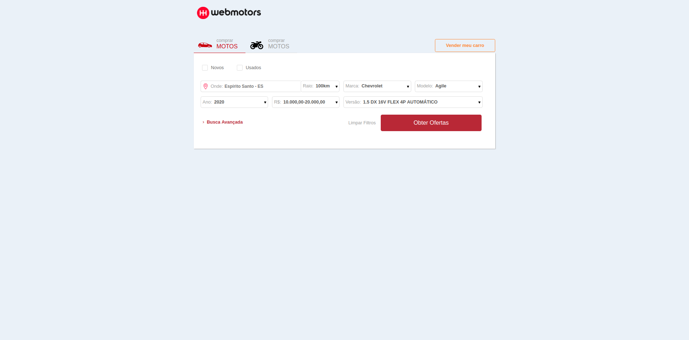

# Webmotors Old Page Clone

Project made as a challenge for the selection process of the company Webmotors.

The form refers to one of the first versions of the webmotors website.

Mainly made with styled components.





## Project setup

```
yarn install
```

### Compiles and hot-reloads for development

```
yarn start
```

### Compiles and minifies for production

```
yarn build
```

### Lints and fixes files

```
yarn lint
```

### Run the Prettier

```
yarn format
```
